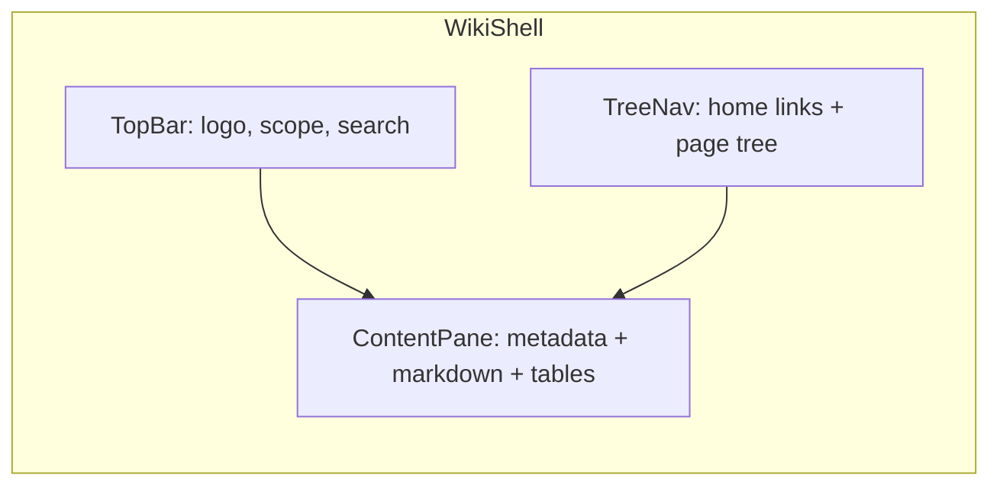
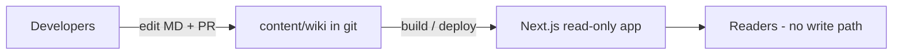

# CCAI Internal Wiki (Meta-style MVP)

Implementation plan for the internal CCAI wiki. Stack: **Next.js 15**, **file-based Markdown**, **shadcn/ui**.

## Context

[`ccai-internal`](../README.md) is a greenfield repo. Product goal: internal CCAI site with **CCAI Wiki**.

### v1 constraints (safety-first) — implemented

- **Read-only for everyone** — no in-app editing, no create/delete UI, no write APIs.
- **Content changes are dev-only** — pages live as Markdown in this repo; updates ship via PR/commit and deploy.
- **No auth** — public read within the deployed site; no login, no Supabase in v1.
- **No backend** — Next.js reads `content/wiki/` at request time.

**Implemented:** grouped sidebar sections, standard frontmatter (`summary`, `owner`, `review_by`, `status`), glossary, contributing guide, templates. See [WIKI_AUTHORING.md](WIKI_AUTHORING.md).

**Deferred:** in-app editing, Supabase, auth, revision UI, bookmarks, comments.

The reference UI (Meta / Eng Bootcamp wiki) breaks down into three regions:





---

## Recommended stack (v1)

| Layer       | Choice                                                   | Why                                                                 |
| ----------- | -------------------------------------------------------- | ------------------------------------------------------------------- |
| App         | **Next.js 15** (App Router) + TypeScript                 | SSR/static pages; no API layer needed                               |
| UI          | **Tailwind + shadcn/ui**                                 | Meta-like shell (sidebar, search dialog)                            |
| Content     | **Markdown files in repo** (`content/wiki/`)             | Dev-controlled; review via PR; git = audit trail                    |
| Parsing     | **gray-matter** + **react-markdown** + **remark-gfm**    | Frontmatter metadata + GFM tables                                   |
| Tree        | **Folder structure** + optional `_meta.json` per folder  | Mirrors wiki hierarchy without a DB                                 |
| Search      | **Build-time index** (e.g. `flexsearch` or Pagefind)     | No DB; index generated at `next build`                              |
| Deploy      | **Vercel / static host**                                 | Zero infra beyond git push                                          |

**Deferred (phase 2+):** Supabase, in-app editor, Supabase Auth + RLS, runtime revision history UI.

---

## Content model (files, not database)

Each page is a `.md` file under `content/wiki/`:

```markdown
---
title: Reaction
owner: Monetization LLM Eng Team
updated: 2026-01-15
order: 3
---

## 5. Diagnosis and Mitigation Tooling

| Category | Purpose | Tool | Description |
| -------- | ------- | ---- | ----------- |
| Triaging | ...     | ...  | ...         |
```

- **URL path** mirrors file path: `content/wiki/eng-bootcamp/reliability/reaction.md` → `/wiki/eng-bootcamp/reliability/reaction`
- **Tree order:** `order` in frontmatter and/or `_meta.json` beside files:

```json
{
  "reliability": { "title": "Reliability", "order": 1 },
  "reaction": { "title": "Reaction", "order": 3 }
}
```

- **Folder index pages:** optional `index.md` in a folder for section landing pages
- **Version history:** **git** (GitHub blame/history links optional in metadata bar); no in-app restore in v1

---

## App structure

```
ccai-internal/
├── content/wiki/                    # sole source of truth (dev-edited only)
│   ├── eng-bootcamp/
│   │   ├── _meta.json
│   │   └── reliability/
│   │       ├── _meta.json
│   │       └── reaction.md
├── src/
│   ├── app/
│   │   ├── layout.tsx
│   │   ├── page.tsx                 # redirect → /wiki
│   │   └── wiki/
│   │       ├── layout.tsx           # WikiShell
│   │       ├── page.tsx             # wiki home
│   │       ├── search/page.tsx
│   │       └── [[...slug]]/page.tsx # read-only view only
│   ├── components/wiki/
│   │   ├── WikiHeader.tsx
│   │   ├── WikiSidebar.tsx
│   │   ├── WikiTree.tsx
│   │   ├── PageMetadataBar.tsx      # last updated, owner (from frontmatter)
│   │   ├── MarkdownRenderer.tsx
│   │   └── SearchDialog.tsx
│   └── lib/wiki/
│       ├── content.ts               # load all pages, build tree (read-only)
│       ├── search-index.ts          # build search index at compile time
│       └── types.ts
└── package.json
```

**Explicitly not in v1:** `edit/` routes, `MarkdownEditor`, `RevisionHistory`, `lib/supabase/`, Server Actions that write.

---

## UI layout (Meta-inspired, read-only)

**Top bar** (`WikiHeader.tsx`)

- CCAI Wiki logo + title
- Scope dropdown (static "All Wiki" for v1)
- Global search (`Cmd+K`) → `SearchDialog.tsx` (read-only results)

**Left sidebar** (`WikiSidebar.tsx`)

- Static links: Home, Search
- Collapsible `WikiTree.tsx` from file tree

**Main pane**

- `PageMetadataBar.tsx`: `updated` and `owner` from frontmatter (no Edit button)
- `MarkdownRenderer.tsx`: GFM body including tables
- Optional: "View history on GitHub" link to file blame (dev audit only)

**No edit mode, no delete, no "new page" in the UI.**

---

## Developer workflow (how pages change)

1. Create or edit files under `content/wiki/`.
2. Open PR; team reviews content (same as code review).
3. Merge → CI builds and deploys → readers see updated wiki.

Document this in README so non-dev contributors know to ask devs or open PRs.

---

## Data loading (read-only)

| Function            | Behavior                                                |
| ------------------- | ------------------------------------------------------- |
| `getAllPages()`     | Glob `content/wiki/**/*.md`; parse frontmatter          |
| `getPageTree()`     | Build nested tree from paths + `_meta.json`             |
| `getPageBySlug()`   | Resolve slug → file; 404 if missing                       |
| `searchPages(query)`| Query pre-built index (no network DB)                   |

All functions are **read-only**; no mutations exposed to the app.

---

## Implementation phases

### Phase 1 — Foundation

- Init Next.js 15, Tailwind, shadcn/ui, ESLint
- Add `content/wiki/` with sample Eng Bootcamp → Reliability → Reaction page (GFM table)
- `lib/wiki/content.ts` — load pages and build tree

### Phase 2 — Shell + navigation

- `WikiShell` layout: header, sidebar, main
- `WikiTree` with expand/collapse + active route
- `wiki/[[...slug]]` read-only page view

### Phase 3 — Search + polish

- Build-time search index + `SearchDialog` + `/wiki/search`
- 404, empty states, responsive layout
- README: `pnpm dev`, how to add a page (dev workflow)

---

## Phase 2 roadmap (future — when safe to allow edits)

Only after auth and permissions are defined:

- **Supabase** (or CMS) for runtime content + revisions
- **Supabase Auth** + **RLS** — editors vs readers
- In-app editor, revision history UI, private pages
- Optional: keep git as source of truth and sync to DB via CI (hybrid)

---

## Key risks and mitigations

| Risk                         | Mitigation                                                              |
| ---------------------------- | ----------------------------------------------------------------------- |
| Non-devs cannot edit in UI   | Document PR workflow; pair with dev for urgent updates                    |
| Stale content                | `updated` in frontmatter; periodic content review in PRs                |
| Slug/path renames break links| Prefer additive paths; redirect map in `next.config` if needed          |
| No access control in v1      | Deploy behind VPN / Vercel password / internal host if needed           |

---

## Success criteria for MVP

- Navigate a multi-level tree and open any page (read-only)
- Pages render markdown + GFM tables correctly
- Search finds pages by title/body keywords
- No write endpoints or edit UI exist in the deployed app
- Content updates only via git; README documents dev workflow
- `pnpm dev` and `pnpm build` work with zero external services

---

## Implementation checklist

- [ ] Scaffold Next.js 15 + Tailwind + shadcn/ui (no Supabase)
- [ ] Add `content/wiki/` sample tree + `reaction.md` with GFM table
- [ ] Implement `lib/wiki/content.ts` (read-only load + tree builder)
- [ ] Build WikiShell: WikiHeader, WikiSidebar, WikiTree
- [ ] Implement `wiki/[[...slug]]` view-only route + PageMetadataBar
- [ ] Add MarkdownRenderer (GFM tables)
- [ ] Build-time search index + SearchDialog + `/wiki/search`
- [ ] README: read-only policy, how devs add/change pages, local setup
