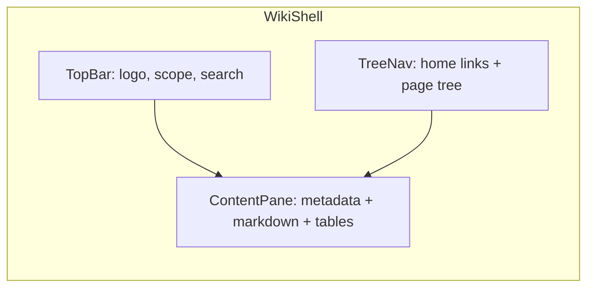
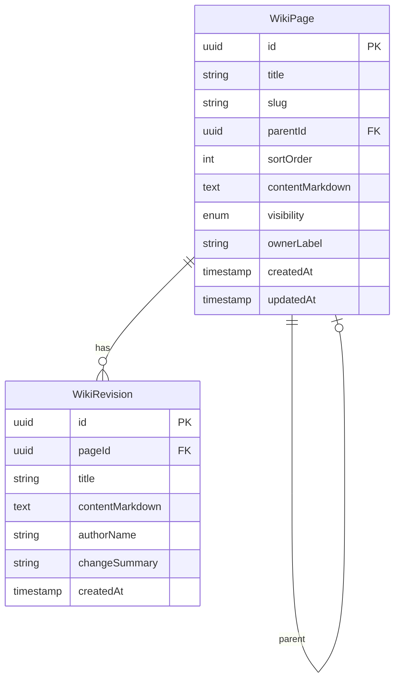

# CCAI Internal Wiki (Meta-style MVP)

Implementation plan for the internal CCAI wiki. Stack: **Next.js 15**, **Supabase**, **shadcn/ui**.

## Context

[`ccai-internal`](../README.md) is a greenfield repo. Product goal: internal CCAI site with **CCAI Wiki**.

- **No auth in v1** — all routes public; permission fields exist in the schema for phase 2.
- **MVP core** — tree nav, view/edit, search, version history, basic page-level permissions (not user-based yet).

The reference UI (Meta / Eng Bootcamp wiki) breaks down into three regions:



---

## Recommended stack

| Layer     | Choice                                                 | Why                                                                    |
| --------- | ------------------------------------------------------ | ---------------------------------------------------------------------- |
| App       | **Next.js 15** (App Router) + TypeScript               | Matches CCAI org TS repos; SSR for fast page loads                     |
| UI        | **Tailwind + shadcn/ui**                               | Fast Meta-like shell (sidebar, command palette search, dialogs)        |
| Backend   | **Supabase** (hosted Postgres + migrations)            | Managed DB, SQL migrations, FTS; Auth/RLS ready for phase 2            |
| Data access | **`@supabase/supabase-js`** + **`@supabase/ssr`**    | Typed queries from Server Actions; no separate ORM layer for MVP         |
| Content   | **Markdown (GFM)** via `react-markdown` + `remark-gfm` | Tables, lists, links like the screenshot; simpler than WYSIWYG for MVP |
| Editor    | **MDXEditor** or split-pane Markdown editor            | Edit with live preview; upgrade to TipTap later if needed              |
| Local dev | **Supabase CLI** (`supabase start`)                    | Local Postgres + Studio; same migrations as production                 |

**Deferred (phase 2+):** Supabase Auth (Google SSO), RLS enforcement, bookmarks, recent activity, view counts, team tags, comments, feedback widget.

### Supabase-specific conventions

- **Migrations:** SQL files in `supabase/migrations/` — version-controlled schema (tables, indexes, FTS, RPCs).
- **Seed:** `supabase/seed.sql` — sample Eng Bootcamp tree + reliability tooling page.
- **Clients:**
  - **Server** (Server Actions): `createServerClient` with `SUPABASE_SERVICE_ROLE_KEY` for unrestricted CRUD in v1 (key never exposed to browser).
  - **Browser** (future realtime/subscriptions): `createBrowserClient` with anon key only after RLS is defined.
- **Env vars:** `NEXT_PUBLIC_SUPABASE_URL`, `NEXT_PUBLIC_SUPABASE_ANON_KEY`, `SUPABASE_SERVICE_ROLE_KEY` (server-only).
- **RLS in v1:** Tables created with RLS **disabled** (or permissive policies) since there is no auth yet; phase 2 enables RLS + Supabase Auth.
- **Search:** Postgres `tsvector` + GIN index defined in a migration; query via `.textSearch()` or a small SQL RPC (`search_wiki_pages`).

---

## Information architecture (best practices baked in)

1. **Hierarchical pages** — parent/child tree (not flat docs); slugs reflect path (`/wiki/eng-bootcamp/reliability/reaction`).
2. **Naming** — enforce `Title` + unique slug per parent; optional templates later (SOP, runbook).
3. **Version history** — immutable revisions on every save; diff + restore.
4. **Search** — Postgres `tsvector` on title + body; header search with keyboard shortcut (`Cmd+K`).
5. **Ownership metadata** — `ownerLabel` string field now (e.g. "Monetization LLM Eng Team"); wire to real users when auth lands.
6. **Visibility** — `public` | `private` page flag in DB; UI badge only in v1 (no gate until auth).

---

## Data model



- **Tree:** adjacency list (`parentId`, `sortOrder`) — sufficient for hundreds of pages; materialized path can come later if needed.
- **Revisions:** insert row on every successful save; current content duplicated on `WikiPage` for fast reads.
- **Search:** `search_vector tsvector` column maintained by trigger (or generated column) + GIN index; exposed via Supabase RPC `search_wiki_pages(query text)`.

**Tables (Supabase):** `wiki_pages`, `wiki_revisions` (snake_case in DB; map to camelCase in app types).

Seed via `supabase/seed.sql`: sample tree mirroring the screenshot (Eng Bootcamp → Reliability → Reaction) so the UI is demonstrable on day one.

---

## App structure

```
ccai-internal/
├── supabase/
│   ├── config.toml
│   ├── migrations/
│   │   └── 20260527000000_wiki_schema.sql   # tables, FTS, search RPC
│   └── seed.sql
├── .env.local.example                       # Supabase URL + keys
├── src/
│   ├── app/
│   │   ├── layout.tsx
│   │   ├── page.tsx                    # redirect → /wiki
│   │   └── wiki/
│   │       ├── layout.tsx              # WikiShell (header + sidebar)
│   │       ├── page.tsx                # wiki home
│   │       ├── search/page.tsx
│   │       └── [[...slug]]/
│   │           ├── page.tsx            # view
│   │           └── edit/page.tsx       # edit
│   ├── components/wiki/
│   │   ├── WikiHeader.tsx
│   │   ├── WikiSidebar.tsx
│   │   ├── WikiTree.tsx
│   │   ├── PageMetadataBar.tsx
│   │   ├── MarkdownRenderer.tsx
│   │   ├── MarkdownEditor.tsx
│   │   ├── RevisionHistory.tsx
│   │   └── SearchDialog.tsx
│   ├── lib/supabase/
│   │   ├── server.ts                   # service-role client for Server Actions
│   │   ├── client.ts                   # browser client (phase 2)
│   │   └── types.ts                    # generated Database types (supabase gen types)
│   └── lib/wiki/                       # CRUD, tree builder, search, revisions
└── package.json
```

---

## UI layout (Meta-inspired)

**Top bar** (`WikiHeader.tsx`)

- CCAI Wiki logo + title
- Scope dropdown (static "All Wiki" for v1; DB `WikiSpace` table optional stub)
- Global search input opening `SearchDialog.tsx`

**Left sidebar** (`WikiSidebar.tsx`)

- Static links: Home, Search (no auth-gated "My wikis" / Private until phase 2)
- Collapsible `WikiTree.tsx` — highlight active page, expand ancestors of current slug
- Resizable/collapsible sidebar (shadcn pattern)

**Main pane**

- `PageMetadataBar.tsx`: relative last updated, owner label, visibility badge, Edit button
- `MarkdownRenderer.tsx`: GFM tables (for tooling matrices like section 5 in the image)
- Footer actions: History, New child page, Delete (confirm dialog)

**Edit mode** (`/wiki/.../edit`)

- Title + slug (auto-slugify from title, editable)
- Parent selector (move in tree)
- Visibility + owner label
- Markdown editor + Save (creates revision) + Cancel

---

## Server actions / API

Use **Next.js Server Actions** (no separate API service for MVP):

| Action                                         | Behavior                                          |
| ---------------------------------------------- | ------------------------------------------------- |
| `getPageTree()`                                | Fetch all pages, build nested tree in memory      |
| `getPageBySlug(slug[])`                        | Resolve path segments to page                     |
| `createPage` / `updatePage` / `deletePage`     | CRUD + revision insert                            |
| `searchPages(query)`                           | Supabase RPC / `.textSearch()` on `search_vector` |
| `getRevisions(pageId)` / `restoreRevision(id)` | History list + restore (creates new revision)     |

Validation with **Zod** on all inputs.

---

## Implementation phases

### Phase 1 — Foundation (scaffold + Supabase)

- Init Next.js 15, Tailwind, shadcn/ui, ESLint
- `supabase init` + link to Supabase project (or local-only via CLI)
- SQL migration: `wiki_pages`, `wiki_revisions`, FTS column/index, `search_wiki_pages` RPC
- `supabase db reset` to apply migrations + `seed.sql`
- Wire `@supabase/ssr` server client; `.env.local.example` with required keys

### Phase 2 — Shell + navigation

- `WikiShell` layout: header, sidebar, main
- Recursive tree component with expand/collapse + active state
- Route `wiki/[[...slug]]` for view; loading/error states

### Phase 3 — Content CRUD

- View page: markdown render + metadata bar
- Edit page: form, save → revision, slug/path update handling
- Create child / delete page flows

### Phase 4 — Search + history

- Postgres FTS + search dialog + `/wiki/search` results page
- Revision history panel + restore

### Phase 5 — Polish

- Empty states, 404 page, basic responsive layout
- README: local setup (`supabase start`, `supabase db reset`, `pnpm dev`)

---

## Phase 2 roadmap (when you add auth)

- **Supabase Auth** — Google OAuth with domain restriction (`@ccai.org` or allowlist)
- Enable **RLS** on `wiki_pages` / `wiki_revisions`: public read, authenticated edit, private pages restricted to owner/team
- Replace service-role Server Actions with user-scoped client where appropriate; keep service role for admin/seed only
- Map `author_name` → `auth.users.id`; enforce `visibility` and editor roles via policies
- Bookmarks, recent activity, view counts, comments (Meta parity items)

---

## Key risks and mitigations

| Risk                      | Mitigation                                                                                          |
| ------------------------- | --------------------------------------------------------------------------------------------------- |
| Slug changes break URLs   | Store stable `id` in routes internally; redirect old slugs via `slug_history` table (optional v1.1) |
| No auth = anyone can edit | Service role on server only in v1; enable Supabase Auth + RLS in phase 2                            |
| Supabase keys leaked      | Never import service role in client components; use Server Actions only                             |
| Markdown vs rich tables   | GFM tables cover screenshot case; TipTap later if non-technical editors struggle                    |

---

## Success criteria for MVP

- Navigate a multi-level tree and open any page
- Create, edit, move, and delete pages with markdown + tables
- Search finds pages by title/body keywords
- Every save creates a revision; user can view and restore prior versions
- Page has `public`/`private` visibility flag and owner label in UI
- `README` documents one-command local setup

---

## Implementation checklist

- [ ] Scaffold Next.js 15 + Tailwind + shadcn/ui + Supabase client + Supabase CLI local dev
- [ ] Add `supabase/migrations` for `wiki_pages` + `wiki_revisions`, FTS index, and `seed.sql`
- [ ] Build WikiShell: WikiHeader, WikiSidebar, WikiTree with active/expand state
- [ ] Implement `wiki/[[...slug]]` view + edit routes with Server Actions for CRUD
- [ ] Add MarkdownRenderer (GFM tables) and MarkdownEditor with save → revision
- [ ] Implement Postgres full-text search + SearchDialog and `/wiki/search` page
- [ ] Build RevisionHistory UI with list, preview, and restore
- [ ] Document Supabase local dev and MVP scope in README
